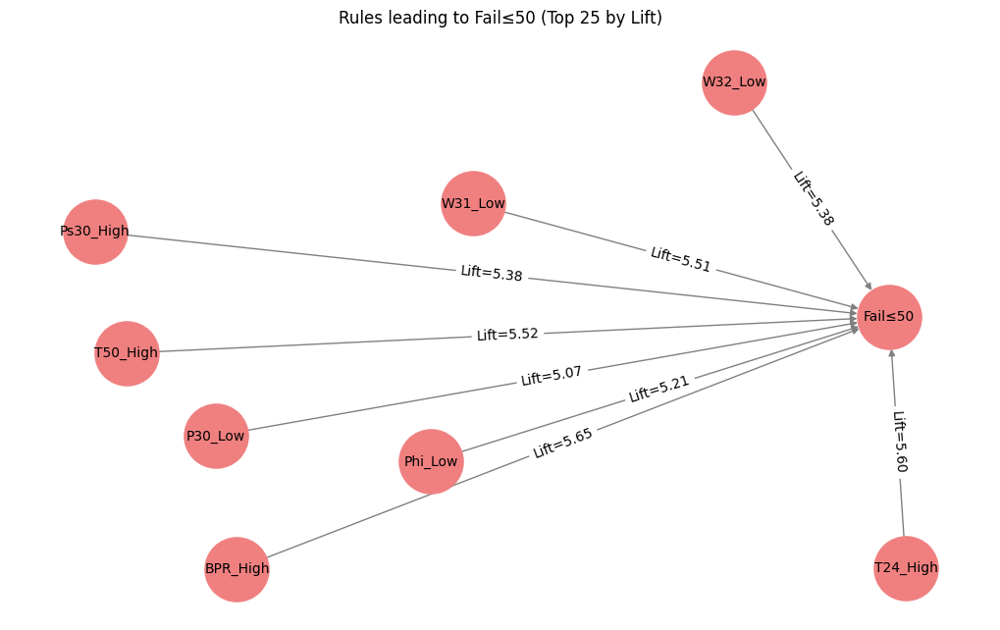
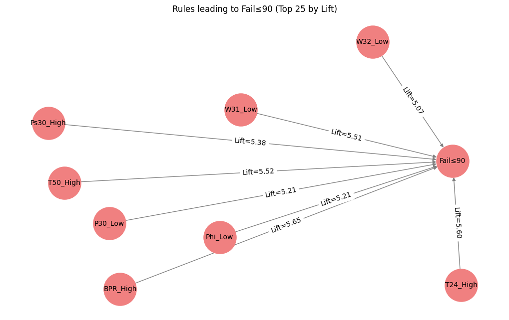
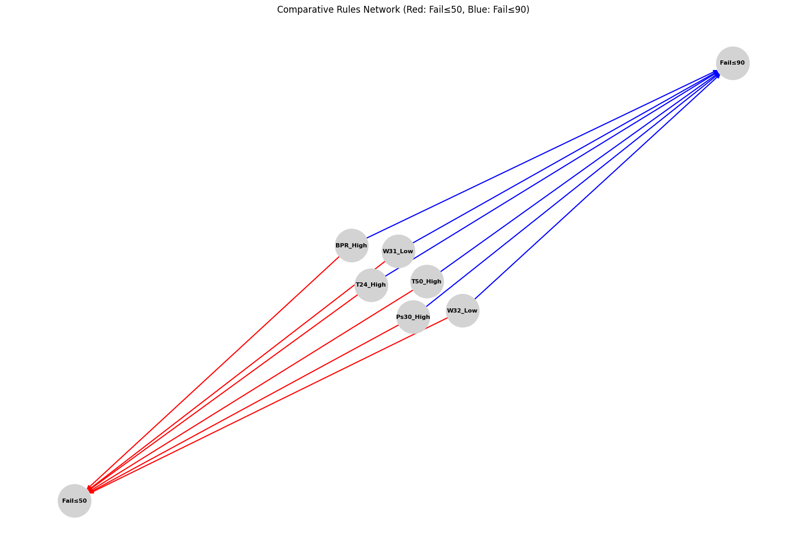

# Early-Warning Rule Mining for Turbofan Engine Degradation 

## Abstract   

**Dataset**  
NASA **C-MAPSS Turbofan Degradation Simulation (subset FD001)**, publicly available through the Prognostics Center of Excellence (PCoE) and mirrored on Kaggle.  

**Objective**  
To determine whether **interpretable association rules** can serve as reliable early-warning indicators for jet-engine failure.  
*Research Question:* *Which combinations of sensor behaviors consistently precede a drop in remaining useful life (RUL) below 50 cycles?*  

**Features**  
Twenty-one onboard sensor streams (temperatures, pressures, fan speed, fuel flow, vibration) and three operating-condition variables.  

**Data Processing Approach**  
For each sliding window of 25 cycles we:  
1. Discretize each sensor reading into **Low** (≤10ᵗʰ percentile), **Normal**, **High** (≥90ᵗʰ percentile)  
2. Encode short-term trends as **Rising** or **Falling** using the sign of the first difference  
3. Represent the window as a transaction containing the active categorical flags  

**Rule Mining Strategy**  
FP-Growth algorithm with parameters:
- `min_support = 3%`
- `min_confidence = 0.8` 
- `min_lift > 1.5`
- Consequents restricted to binary target `Fail≤50`

### Association Rule Mining Approach

**Key Concepts:**
* The target label is engineered from raw data to guide rule extraction
* For FP-Growth, `Fail≤50` functions as a transaction item, similar to market basket analysis
* Meaningful patterns emerge when filtering for rules predicting the `Fail≤50` item

**Benefits:**
* **Focus:** From ~100,000 potential rules, we extract only those relevant to failure prediction, improving interpretability
* **Evaluation:** Binary alert status enables calculation of precision, recall, and other metrics for comparison with alternative predictive maintenance methods

**Expected Outcomes**  
A concise rule set (e.g. `{T50_High, s11_Rising, s15_Drop} → Fail≤50`) predicting imminent failure with:
- Confidence ≥ 90%
- Information gain > 1.5× baseline

**Business Impact**  
The rules provide:
- Transparent decision support for maintenance teams
- Early warning up to 50 cycles in advance
- Support for proactive maintenance scheduling
- Full auditability for engineering review
- Regulatory compliance documentation

---  

## Study Design and Data Source  

| Item | Detail |
|------|--------|
| **Dataset Name** | C-MAPSS Turbofan Degradation Simulation – FD001 subset |
| **Source** | NASA Prognostics Center of Excellence (PCoE); Kaggle mirror |
| **Observations** | 20,631 training rows (100 engines) |
| **Variables** | 26 total (unit ID, cycle, 3 operating settings, 21 sensors) |
| **Description** | Time-series data of simulated turbofan engine operations from healthy start until failure. Includes sensor readings (temperatures, pressures, speeds) and operating conditions (altitude, Mach number, throttle angle). RUL calculated as cycles until failure. |

---  

## Target Variable  

| Field | Detail |
|-------|--------|
| **Name** | `Fail≤50` |
| **Type** | Binary flag |
| **Definition** | 1 when window midpoint is within 50 cycles of failure; 0 otherwise |

| Category | Count | Percentage |
|----------|------:|----------:|
| 1 (Fail≤50) | 4,956 | 24.2% |
| 0 (Healthy) | 15,475 | 75.8% |

---  

## Variable Statistics  

### Categorical Features
*(post-discretization)*

| Variable | Category | Count | Percentage |
|----------|----------|------:|----------:|
| `T50_flag` | High | 2,845 | 13.9% |
|           | Low  | 2,763 | 13.5% |
|           | Rising | 8,124 | 39.7% |
|           | Falling | 7,987 | 39.0% |

### Continuous Features
*(pre-binning)*

| Variable | Min | Max | Mean | Median | Std Dev |
|----------|----:|----:|-----:|-------:|---------:|
| `T30` | 1583.2 | 1616.8 | 1591.4 | 1590.9 | 5.87 |
| `P15` | 20.12 | 21.68 | 21.10 | 21.09 | 0.23 |

---  

## Feature Engineering Decisions  

| Variable | Action | Rationale |
|----------|--------|-----------|
| `unit` | Drop | Identifier only |
| `cycle` | Transform→RUL, Drop | Used for RUL calculation |
| `op_setting_1` | Keep | Altitude load effects |
| `op_setting_2` | Keep | Mach number correlations |
| `op_setting_3` | Drop | No variance in FD001 |
| Sensors (21) | Bin + Trend | Level/trajectory capture |
| `RUL` | Binary `Fail≤50` | Rule mining target |

## Processing Details
1. **Data Loading and RUL Calculation**  
   - Load the training and test datasets using `pandas.read_csv()` with predefined column names.  
   - Compute each engine’s Remaining Useful Life (RUL) by grouping on the engine identifier (`unit`) and subtracting the current cycle from the maximum cycle observed, then drop the temporary column.

2. **Transaction Creation via Sliding Windows**  
   - For each engine, use a sliding window (length = 25 cycles) to extract a segment of sensor readings.  
   - Discretize each sensor value by comparing its mean over the window against the 10ᵗʰ (Low) and 90ᵗʰ (High) percentiles.  
   - Capture short-term trends by tagging the window as `Rising` if the last sensor value exceeds the first, or `Falling` otherwise.
   - Append failure labels (`Fail≤50` and `Fail≤90`) to a window based on the RUL at its end.

3. **Transaction Encoding and Verification**  
   - Encode the list of sensor feature sets using `mlxtend.preprocessing.TransactionEncoder` to form a one-hot encoded DataFrame.  
   - Confirm that the number of generated windows matches the expected total calculated from the dataset.

4. **Data Cleaning and Visualization**  
   - Remove constant (uninformative) features from the generated transactions.  
   - Visualize the frequency of the most common features and display a sample binary feature matrix to inspect the data.

5. **Association Rule Mining and Network Visualization**  
   - Extract frequent itemsets using the FP-Growth (apriori) algorithm with specified parameters (min_support=0.03, min_confidence=0.8, lift > 1.5).  
   - Generate association rules filtered on lift and target labels (`Fail≤50` and `Fail≤90`).  
   - Visualize the top rules and their interrelationships through network graphs for both failure thresholds.

## Visualizations  

	
	

	

These graphs show how the top 10 most predictive features vary across time leading to failure, helping to visually confirm the rule mining output.

## Final Notes  

**Documentation Checklist:**
- [x] All variables explained
- [x] Processing steps justified
- [x] Clear technical writing